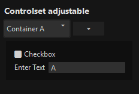

# ControlSet  
* Create sets of controls switchable with dropdown menu  

| __document__( \_document )    |Set document where ControlSet is working, pane or preferences document    |  
|:---    |:---    |  
|`@param string` \_document    |    |  
|`@return self`    |    |  

##  

| __element__( controlset_selector )    |Set controlset_selector    |  
|:---    |:---    |  
|`@param string` controlset_selector    |    |  
|`@return self`    |    |  

##  

| __load__( containers_data )    |Create controlset dom with menu and toggable containers with controls    |  
|:---    |:---    |  
|`@param object` containers_data    |Data for controlset`s controls    |  
|`@return self`    |    |  
> If exist, then controlset is refreshed  

##  

| __select__( index, select_index )    |Select item in menu and change visible container    |  
|:---    |:---    |  
|`@param int` index    |Index of menu element, select last item if select_index < 0    |  
|`@return self`    |    |  

##  

| __add__( [container_label] )    |Add new container by markup template    |  
|:---    |:---    |  
|`@param string` [ container_label=null ]    |Label of container shown in dropdown    |  
|`@return self`    |    |  

##  

| __remove__( [index] )    |Remove container    |  
|:---    |:---    |  
|`@param int` [ index=null ]    |Index of container to remove, if null, then current is removed    |  
|`@return self`    |    |  

##  

| __dropdown__()    |Get dropdown in control set    |  
|:---    |:---    |  
|`@return object`    |[Dropdown](../Dropdown)    |  

##  


# Examples  

### Controlset adjustable  

__Markups in .xul file__  
Into this elements is controlset loaded  
``` xml
<!--Controlset-->
<vbox id="controlset_wrapper"  
      caption="Controlset"  
      template='["checkbox", "textbox"]'  
>  
</vbox>

<!--Controlset adjustable-->
<vbox id="controlset_wrapper"
      adjust="true"
      caption="Controlset"
      template='[{"type":"checkbox","label":"Checkbox",},{"type":"textbox","label":"Enter Text"}]'
>  
</vbox>
```  

__JavaScript__  

``` JavaScript  
var containers_data =  
{  
    'Container A':{  
        'Control A':    false,  
        'Enter Text A': 'Foo Text A',  
    },  
    'Container B':{  
        'Control B':    true,  
        'Enter Text B': '',  
    }  
};  

ControlSet()  
        .document(document)  
        .element( '#controlset_wrapper' ) // use this element  
        .load( containers_data )          // load this data  
        .select(1);                       // selected set on init  
```  
__Result__  
  
  