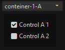

# UI  
* Manage extension`s ui elements  


## Methods  

| __document__( \_document )    | Set document where UI is operating, pane or preferences window    |  
|:---    |:---    |  
|`@param string` \_document    |    |  
|`@return self`    |    |  

##  

| __$__( selector, [parent] )    |Query selector in document    |  
|:---    |:---    |  
|`@param string` selector    |Selector of node    |  
|`@param null` [ parent=null ]    |Selector of parent, if null, then current document is used    |  
|`@return type`    |[QueryObject](https://docs.activestate.com/komodo/11/sdk/api/module-ko_dom-QueryObject.html)    |  

##  

| __create__( type, [attributes], [children] )    |Create dom element or array of elements    |  
|:---    |:---    |  
|`@param string` type    |Type of node to append    |  
|`@param null\|string\|object|[object]` [attributes]    |Attributes for controls, define array of strings or array of objects for adding multiple nodes    |  
|`@param array` [ children=null ]    |Array of attributes [type, attributes, create] for nested loop of create() function  
|`@return array`    |created node or array of created nodes    |  

##  
| __values__( selector, [only_prefs], parent_selector )    |Get values of parent node controls    |  
|:---    |:---    |  
|`@param string` selector    |    |  
|`@param mixed` [ only_prefs=false ]    |if not false, then take only nodes without attribute prefs="false"    |  
|`@return {id:value}`    |Object of node ids and values    |  

##  

| __append__( parent, elements )    |Append new children to node    |  
|:---    |:---    |  
|`@param node\|string` parent    |Node element or selector of parent to append children    |  
|`@param element\|array` elements    |Element to append    |  
|`@return self`    |    |  

##  

| __empty__( [selector] )    |Remove child element    |  
|:---    |:---    |  
|`@param string` [ selector=null ]    |Selector of node    |  
|`@return self`    |    |  

##  

| __createPrefSet__( prefset_selector, perfset_template, perfset_values )    |Create prefset dom with menu and toggable containers with controls    |  
|:---    |:---    |  
|`@param string` prefset_selector    |Id of dom wrapper where menu abd all containers are inserted    |  
|`@param object` perfset_template    |Representation of container xul structure    |  
|`@param object` perfset_values    |Data for pref set`s controls    |  

##  


# Examples  
__createPrefSet()__  - this code creates working element below  
``` JavaScript  
    var template = {'Prefset Caption': ['checkbox', 'textbox']};  
    var values   = {  
                        'Container A':{  
                            'Control A':    false,  
                            'Enter Text':   'Foo Text',  
                        },  
                        'Container B':{  
                            'Control B':    true,  
                            'Enter Text':   '',  
                        }  
                    };  

    paneUI().createPrefSet('#pref_set_test', template, values );  
```  
__Generated prefset element__  
``` xml
<vbox id="ui_test_prefset" style="padding:5px">
	
	<caption label="Prefset test" id="prefset_test" />
	
	<menulist id="" sizetopopup="pref" label="Container A">
		<menupopup id="">
			<menuitem id="container_aitem" label="Container A" selected="true" />
			<menuitem id="container_bitem" label="Container B" />
		</menupopup>
	</menulist>
	
	<groupbox id="container_a" class="#ui_test_prefset-shown" style="display:block">
		<checkbox label="Control A" checked="false" id="control_a" />
		<hbox id="">
			<label value="Enter Text A" control="enter_text_a" id="" />
		</hbox>
		<textbox label="Enter Text A" value="Foo Text A" id="enter_text_a" />
	</groupbox>
	
	<groupbox id="container_b" style="display:none">
		<checkbox label="Control B" checked="true" id="control_b" />
		<hbox id="">
			<label value="Enter Text B" control="enter_text_b" id="" />
		</hbox>
		<textbox label="Enter Text B" value="" id="enter_text_b" />
	</groupbox>
	
</vbox>
```  

__Prefset element rendered__  
  
  